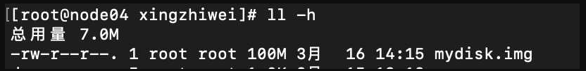

### 虚拟目录树

vfs  虚拟文件系统


```shell
dd if=/dev/zero of=mydisk.img bs=1048576 count=100

losetup /dev/loop0 mydisk.img

mke2fs /dev/loop0 #格式化

```




df


```shell
mount /dev/loop0 /root/xingzhiwei/root
```


```shell
umount /root/xingzhiwei/root
```


### 文件类型


一切皆文件 I/O

-:普通文件（可执行，图片，文本）
d:目录
l:连接
b:块设备（硬盘）
c:字符设备（键盘，socket网卡） CHR
s:socket
p:管道pipeline
[eventpoll]:epoll内存区域


### 文件描述符 inode 脏 dirty

文件描述符 文件的基本信息和偏移量

```shell
lsof -op $$

exec 8< ooxx.txt

read a 0<& 8

echo $a

pcstat

```

任何程序都有0，1，2
0:标准输入
1:标准输出
2:报错输出


### 重定向：不是命令，是一种机制

ls ./ 1> ~/ls.out


###  管道

前面的输出是后面的输入

解释执行，bash看到管道会在左边启动给一个子进程，右边启动一个子进程。通过管道对接起来

解释执行优先级
 ```
 $$ > | > $BASHPID
 ```


### 父子进程

变量
export

```shell
pstree
```

### PageCache


所有app进程和硬件的 IO 都交由 kernel 进程处理。比如app进程读取硬盘数据时，先触发 cpu 指令（int 0x80）， cpu 查询中端描述符表执行对应的 call back 方法，进行用户态内核态切换。kernel 进程通过协处理器的帮助按照 pagecache （4k）大小读取硬盘数据。数据读取完成时，DMA 向 cpu 发送中断信号。


多个 app 进程共享一个 kernel 进程。对于单个 app 进程而言，资源是隔离的。根据程序代码、内存、和 cpu 的 mmu 产生虚拟空间映射表。 所有 app 进程都访问自己的虚拟空间。在物理内存中可能只有
一个文件，但是两个进程访问，每个进程维护自己的fd（文件描述符），seek（偏移量）不同。


### 跟 JAVA 代码相结合

```java
// 基本的 File 写入
File file = new File(path);
FileOutputStream out = new FileOutputStream(file);
while(true){
	Thread.sleep(10);
	out.write(data);

}

// buffer 文件 IO
//  jvm  8kB   syscall  write(8KBbyte[])
File file = new File(path);
BufferedOutputStream out = new BufferedOutputStream(new FileOutputStream(file));
while(true){
	Thread.sleep(10);
	out.write(data);
}
```

基本的文件写入，每次都会有系统调用。用户态内核台不停切换。
buffer 文件 io ， 在 jvm 中 有一个 8KB 的缓冲区，，每次缓冲区写满进行系统调用，写入 kernel pagecache。
用户态、内核态切换，并不等于落盘。在不调用 flush 的情况下，写入磁盘是由 kernel 决定的，与kernel 配置参数有关。此处涉及到脏页。


```shell
vi /etc/sysctl.conf
```


```vi
vm.dirty_background_ratio = 0
vm.dirty_background_bytes = 1048576
vm.dirty_ratio = 0
vm.dirty_bytes = 1048576
vm.dirty_writeback_centisecs = 5000
vm.dirty_expire_centisecs = 30000
```


使用到 mmap

```java
// NIO
RandomAccessFile raf = new RandomAccessFile(path, "rw");

raf.write("hello mashibing\n".getBytes());
raf.write("hello seanzhou\n".getBytes());
System.out.println("write------------");
System.in.read();

raf.seek(4);
raf.write("ooxx".getBytes());

System.out.println("seek---------");
System.in.read();

FileChannel rafchannel = raf.getChannel();
//mmap  堆外  和文件映射的   byte  not  objtect
MappedByteBuffer map = rafchannel.map(FileChannel.MapMode.READ_WRITE, 0, 4096);


map.put("@@@".getBytes());  //不是系统调用  但是数据会到达 内核的pagecache
//曾经我们是需要out.write()  这样的系统调用，才能让程序的data 进入内核的pagecache
//曾经必须有用户态内核态切换
//mmap的内存映射，依然是内核的pagecache体系所约束的！！！
//换言之，丢数据
//你可以去github上找一些 其他C程序员写的jni扩展库，使用linux内核的Direct IO
//直接IO是忽略linux的pagecache
//是把pagecache  交给了程序自己开辟一个字节数组当作pagecache，动用代码逻辑来维护一致性/dirty。。。一系列复杂问题

System.out.println("map--put--------");
System.in.read();

//        map.force(); //  flush

raf.seek(0);

ByteBuffer buffer = ByteBuffer.allocate(8192);
//        ByteBuffer buffer = ByteBuffer.allocateDirect(1024);

int read = rafchannel.read(buffer);   //buffer.put()
System.out.println(buffer);
buffer.flip();
System.out.println(buffer);

for (int i = 0; i < buffer.limit(); i++) {
	Thread.sleep(200);
	System.out.print(((char)buffer.get(i)));
}

```

